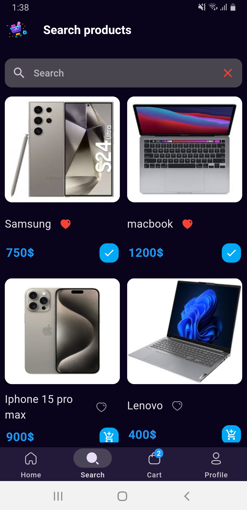

# shopsmart

# adaptive_layout_practice
<strong>This is mobile screen!</strong>
  

  

  

  

  

  

  

  

  

  

  

  

  

  

  

  

<h1>Packages used in this application :</h1>

https://pub.dev/packages/cupertino_icons

https://pub.dev/packages/shared_preferences

https://pub.dev/packages/provider

https://pub.dev/packages/iconly

https://pub.dev/packages/fancy_shimmer_image

https://pub.dev/packages/dynamic_height_grid_view

https://pub.dev/packages/card_swiper

https://pub.dev/packages/ionicons

https://pub.dev/packages/uuid

https://pub.dev/packages/firebase_auth

https://pub.dev/packages/firebase_storage

https://pub.dev/packages/cloud_firestore

https://pub.dev/packages/google_sign_in

https://pub.dev/packages/fluttertoast
